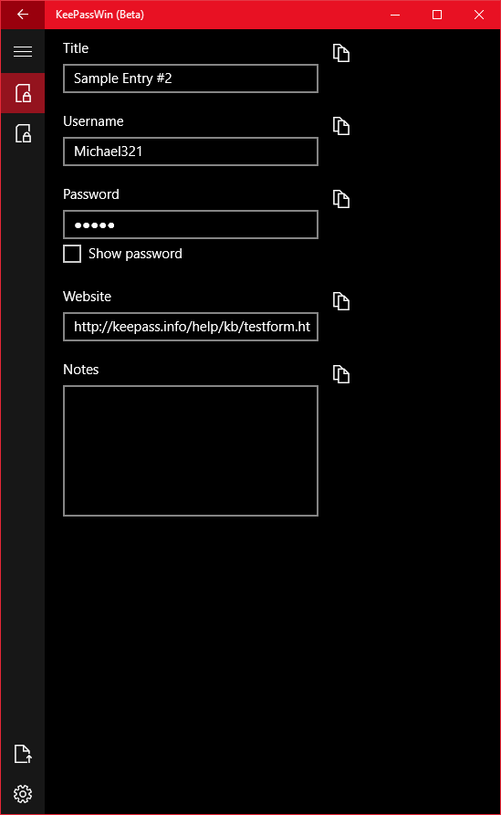
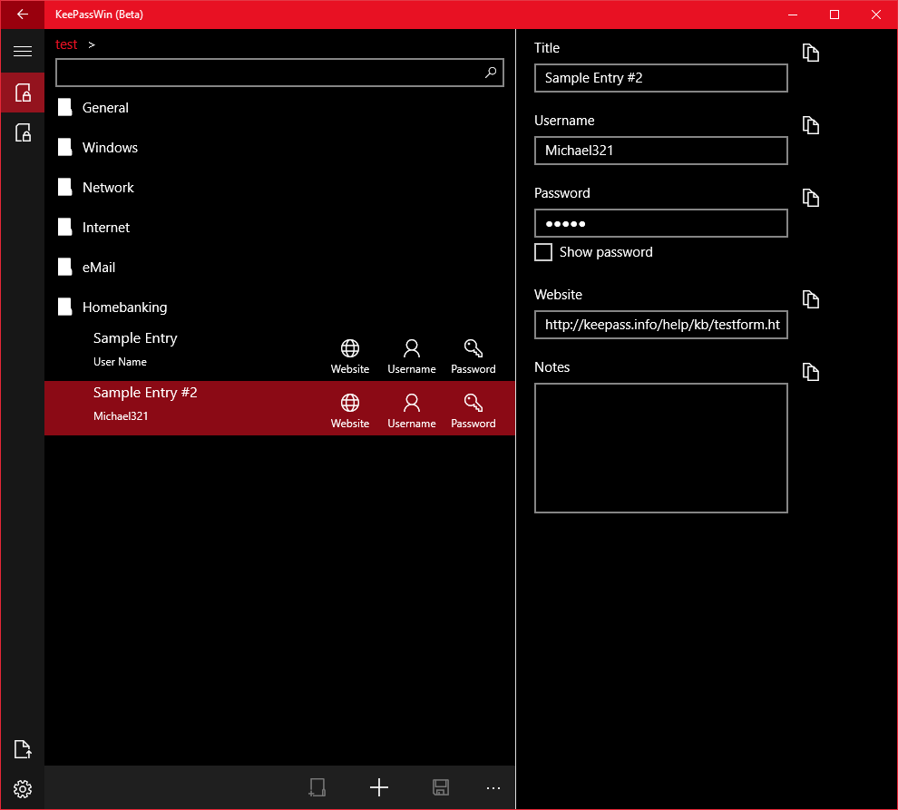

# KeePassWin

## Install
Install from the [Windows Store](https://www.microsoft.com/en-us/store/p/keepasswin/9wzdncrd91jm).

Build status: 

## Overview

This is a universal Windows implementation of [KeePass](http://keepass.info) that supports all Windows 10 devices.

## Features

For a list of features, please see the [changelog](CHANGELOG.md).

### Narrow view:

| List view | Details View |
| --------- | ------------ |
|  | |

### Wide view

## Contribute

This is a side project I have worked on off and on and figured others would appreciate it and maybe help contribute. Any help is very much appreciated. Please see [here](CONTRIBUTING.md) for steps to contribute